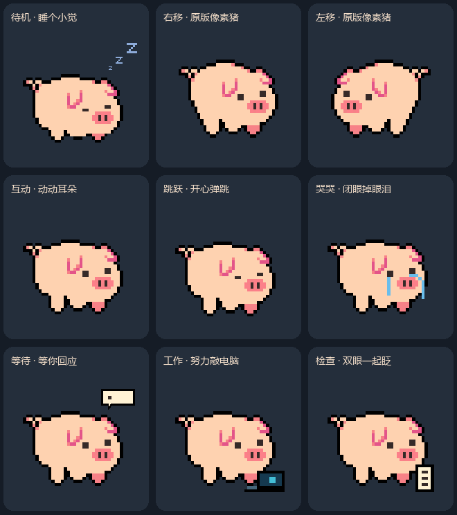

# codex咕咕猪宠物

一只住在 Codex 桌面里的像素咕咕猪。应用中显示为 **咕咕猪 · 像素搭子**。



## 预览

双击 `preview.html`，可以切换 9 类动作、暂停检查单帧、切换深浅背景，并用鼠标测试 16 个观察方向。页面无需联网。

`previews/all-actions.gif` 是同时播放 9 类动作的动画总览。

## 安装

1. 从 [Releases 下载最新安装包](https://github.com/zbzbdzb/codex-gugu-pig-pet/releases/latest)，解压 ZIP。
2. Windows 用户双击解压后的 `安装.cmd`。
3. 打开 Codex 设置 → Pets/宠物，选择 **咕咕猪 · 像素搭子**。

默认安装 v2 版本；安装器使用 `CODEX_HOME`，未设置时使用 `%USERPROFILE%\.codex`。无需安装 Python 或 Node.js 即可使用打包好的宠物。

安装只复制两个资源文件到 `pets/gugu-pig/`，不会修改 Codex 程序、插件或当前宠物选择。双击安装脚本更新同名宠物时，会先把旧资源备份到 Codex 数据目录的 `pet-backups/gugu-pig/时间戳/`。直接调用 PowerShell 脚本时，更新需要带 `-Update`。

在 Codex 设置 → Pets/宠物中选择 **咕咕猪 · 像素搭子**。如果列表未刷新，重新打开设置或稍后重启 Codex。

手动安装：把 `dist/gugu-pig` 文件夹复制到你的 Codex 数据目录下的 `pets` 文件夹。

旧客户端可以使用 `dist/gugu-pig-v1`，或执行：

```powershell
powershell -NoProfile -ExecutionPolicy Bypass -File .\install.ps1 -Legacy
```

## 内容

| 动作 | 帧数 | 设计 |
| --- | ---: | --- |
| idle | 6 | 闭眼睡觉、轻微呼吸，短腿蜷起，右上方像素 zzz 轻轻浮动 |
| running-right | 8 | 直接使用用户原始像素猪 GIF 八帧 |
| running-left | 8 | 原始八帧的逐帧镜像 |
| waving | 4 | 动动耳朵：原地站稳，耳尖轻轻收拢再放松，双眼同步眨动 |
| jumping | 5 | 蓄力眯眼、起跳与腾空时成对的小弧形笑眼、下降睁眼、落地眯眼 |
| failed | 8 | 两只眼睛中性眨眼，双侧流泪，没有笑眼 |
| waiting | 6 | 安静站立、双眼眨动，头顶气泡内省略号依次出现 |
| running | 6 | 小电脑前认真工作 |
| review | 6 | 检查小清单，只让两眼同步眨眼，不加笑眼等表情 |
| 观察方向 | 16 | 从向上开始顺时针排列 |

v2 共 73 个有效帧，透明 WebP 图集 1536×2288，每格 192×208；未使用格完全透明。v1 保留 57 个动作帧、图集 1536×1872。

播放节奏按本机 Codex 26.915.4065.0 资源代码核对。应用的 idle 时长是原始动画时长的 6 倍；其他动作由应用控制触发和回到待机。本项目预览默认循环选中动作，方便检查，不代表应用会持续执行该动作。

## 制作与检查

- 原图可无损还原成 40×35 像素网格。`scripts/pixel_animation.py` 以原图第一帧为共用底稿，只修改顶部背线、后侧轮廓、双眼区域和指定动作部位。背线保留浅缓的阶梯弧度，高处降低一格，不使用横向截平。后侧在 x=6..11、y=18..25 的小范围内调整为臀部略鼓、腿根内收，避免连续直斜线。
- 左右移动直接抽取原始 8 帧，经统一最近邻缩放后组装，左移只做镜像；保留用户指定的原始步态。
- 眼睛保持原图 2×2 的尺寸和一高一低的位置；鼻子和尾巴为受保护区域。耳朵仅在“动动耳朵”中让耳尖轻动一格。站立保留三条原图可见腿；睡觉只缩短腿部两格，沿用原图腿部侧边、脚底和粉色前蹄，使腹部自然衔接。眼泪绕过鼻子，电脑和清单放在脸下方。
- 所有角色帧来自同一份原始像素素材，通过代码局部编辑；构建过程不依赖图像生成服务。
- 输出处理：统一最近邻缩放、对齐、组装和无损 WebP 导出；身体保持原图纯色，不添加渐变。
- 格式检查：73 帧完整、透明边缘、未使用格、边界安全区、各动作存在帧变化、WebP 无损往返一致。
- `validation.json` 保存格式检查；`validation-pixels.json` 检查原图网格无损提取、鼻子/尾巴保持一致、除动耳动作外耳朵保持原样，以及检查动作只改变双眼区域。`validation-installation.json` 保存安装器测试结果。详见 [测试记录](TESTING.md)。原生 Codex 窗口的自动状态触发尚未进行 UI 自动化验证。
- 观察方向为离散姿态，部分相邻角度差异较小；左右换向以角色转向表现。

## 素材来源

基础素材：《像素猪.gif》，由项目委托者提供，保存在 `sources/` 中以便重新构建。

动作研究参考：《跳跳猪》《哭哭猪》《你已笨哭猪》，以及 [PigHub](https://pighub.top/) 的《快跑猪》《咕咕猪干活》《猪瞌睡》《疑惑猪》《猪开心》。这些研究图片不随仓库分发。当前角色像素均来自基础 GIF，电脑、清单、泪滴及提示符号由代码绘制。

来源索引：`sources/manifest.json`。网站对应的开源图库：[BadFish-HSrui/PigHub-DB](https://github.com/BadFish-HSrui/PigHub-DB)。格式参考：[pet-creator-studio](https://github.com/lujunnanm/pet-creator-studio) 与本机应用资源。

本项目是个人桌面使用的衍生宠物制作，不代表 PigHub 或角色作者官方作品；未将网站源代码许可视为角色素材授权。

## 重新构建

在 Windows 上安装 Python 3.10+ 和 Node.js：

```powershell
python -m pip install -r requirements.txt
python scripts/build_pet.py
python scripts/make_preview.py
node scripts/verify_preview.cjs
python scripts/verify_installation.py
python scripts/package_release.py
```

中文预览标签使用 Windows 自带的微软雅黑字体。`dist/` 包含安装资源，`previews/` 包含展示图；构建时生成的独立帧写入 `frames/`。GitHub Release ZIP 面向直接安装，仓库源代码面向自行修改和重新构建。
